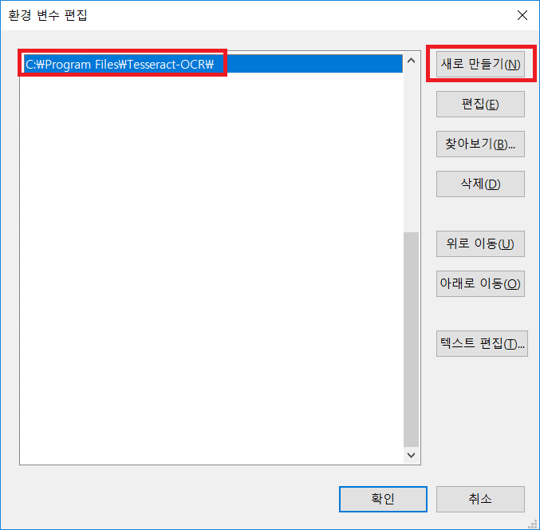
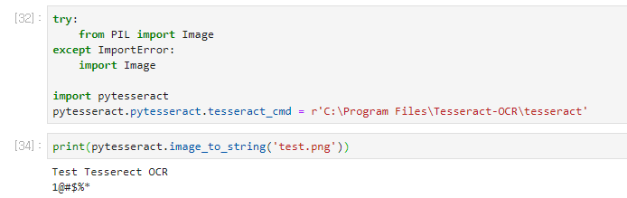

# License Plate Recognition (차량 번호판 인식기)

- Recognize location of plate
- Recognize characters in plate using [tesseract](https://github.com/tesseract-ocr/tesseract)
- [](https://youtu.be/PpTl7xxGXh4)


-----


## Dependencies

- Python 3+
- pytesseract 4.0
  - [kor.traindata](https://github.com/tesseract-ocr/tessdata/blob/master/kor.traineddata)
- OpenCV
- numpy
- matplotlib

-------


# 설치방법

-----


## Tesseract 설치

아래의 위치로 접속하게되면, tesseract-ocr-w64-setup-v4.1.0.20190314 (rc1) (64 bit) 다운로드 링크를 확인 하실 수 있습니다. 다운로드 링크를 클릭하여 설치 파일을 다운로드합니다. (2019.05.20 기준 버전)

 

<https://github.com/UB-Mannheim/tesseract/wiki>

 

설치중에 Additional language data(download) 부분에서 한글 인식을 원하시면 Korean을 선택하시면 됩니다.


치중에 Additional language data(download) 부분에서 한글 인식을 원하시면 Korean을 선택하시면 됩니다.

 

설치가 완료되면 x64 O/S기준 기본 경로인 "C:\Program Files\Tesseract-OCR"에 설치되어 있음을 확인할 수 있습니다.

바탕화면의 내 PC > 속성 > 고급 시스템 설정 > 환경변수 > 시스템 변수 > Path에 위의 경로를 Command Prompt 수행후 어느 위치에서나 실행 가능하도록 추가합니다.




https://github.com/tesseract-ocr/tessdata/blob/master/kor.traineddata


위 주소의 파일을 받아 C:\Program Files\Tesseract-OCR\tessdata 에 저장해주시면 됩니다.


----


## Tesseract Python Package 설치 및 테스트

  Command Prompt에서 Tesseract Python Package를 다음과 같이 pip를 통해 설치합니다.

```
pip install pytesseract
```


자세한 내용은 아래 링크를 참고 하시기 바랍니다.

<https://github.com/madmaze/pytesseract>

 

설치 완료후 아래와 같이 Python 코드를 수행합니다.

```
try:
    from PIL import Image
except ImportError:
    import Image
import pytesseract

pytesseract.pytesseract.tesseract_cmd = r'C:\Program Files\Tesseract-OCR\tesseract'

print(pytesseract.image_to_string(Image.open('test.png')))
```

아래의 스크린샷의 경우 위의 코드를 쥬피터 노트북에서 실행한 결과입니다. 정상적으로 수행되었음을 확인할 수 있습니다.


쥬피터 노트북에서 Tesserect OCR 실행 결과


 

\* 참고

- <https://github.com/tesseract-ocr/tesseract>
-  <https://github.com/UB-Mannheim/tesseract/wiki
- <https://github.com/madmaze/pytesseract>
-  https://arclab.tistory.com/262